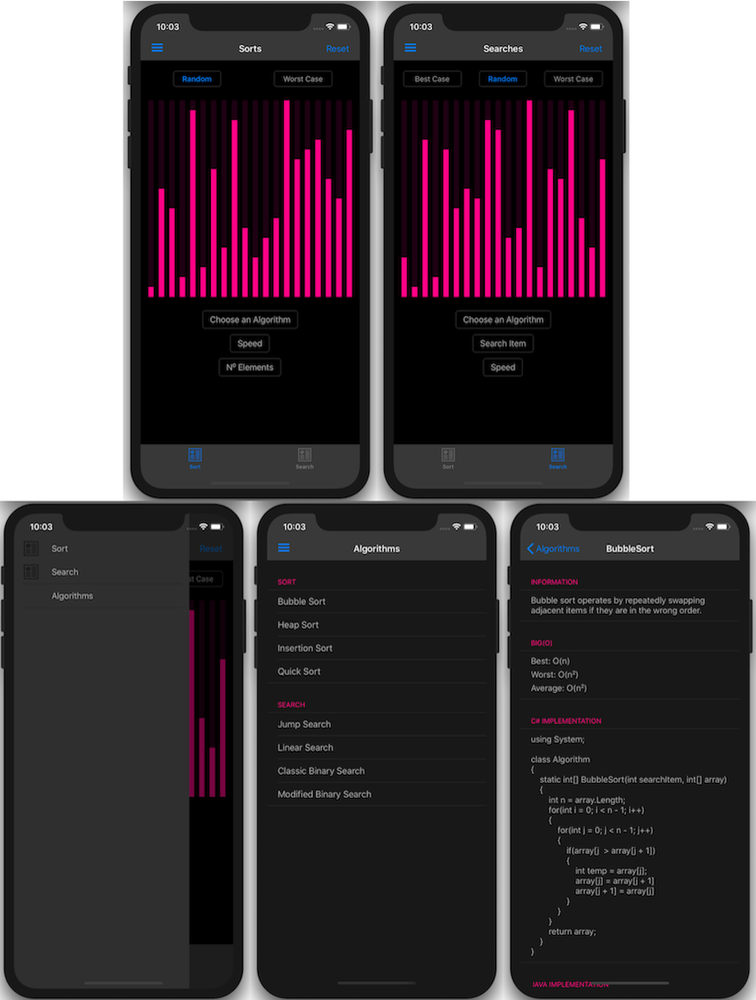
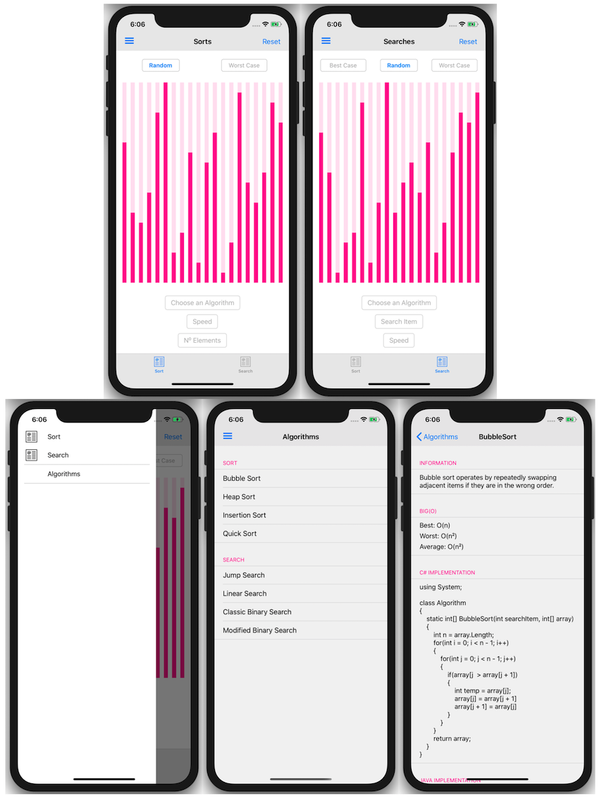

# Algorithms

## Sorting and Searching Algorithms Visualiser.

#### Sorting on iPhone 11: 

  
#### Searching on iPad Pro (12.9-inch)
 

------------------------------

## Meet the Algorithms
The app displays information about each algorithm with simple implementations in C#, Java and Python.

#### Sorts:
1. Bubble Sort
2. Insertion Sort
3. Heap Sort
4. Quick Sort
5. Merge Sort
6. Selection Sort
#### Searches:
1. Linear Search
2. Binary Search
3. A Modified Binary Search
4. Jump Search
5. Interpolation Search
6. Fiboncci Search

------------------------------

## About
#### Graphing API: ["Microcharts"](https://devblogs.microsoft.com/xamarin/microcharts-elegant-cross-platform-charts-for-any-app/)

#### The app was developed using Xamarin.Forms and supports all iOS 13.5 devices:

| Device                    |
| ------------------------- |
| iPhone 8 and above        |
| iPhone 8 Plus and above   |
| iPhone SE (2nd Gen)       |
| iPad Pro (9.7")           |
| iPad Pro (12.9")(4th Gen) |
| iPad Pro (11")(2nd Gen)   |
| iPad Air (3rd Gen)        |
| iPad (7th Gen)            |

------------------------------

## Colour Themes

#### This app now supports customizable colour schemes thoughout the app as well as Dark and Light modes.

### Screenshots of iPhone 11 in Dark Mode

### Screenshots of iPhone 11 in Light Mode

------------------------------

